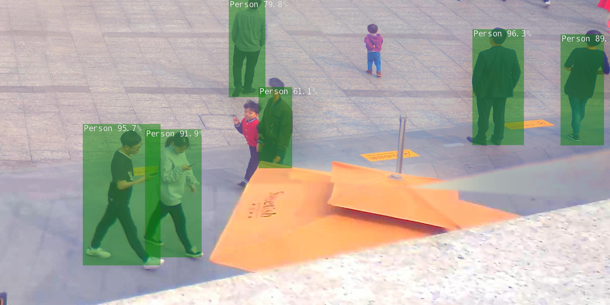

# IW276WS20P8: SSD Detector 

This project includes the optimization of the existing methods and technologies to detect larger numbers of people from CCTV cameras in public places.
Our approach works with the help of a pre-trained machine learning model that runs on a Jetson Nano in a Docker container.

<p align="center">
  
</p>

> This work was done by Stanislava Anastasova, Kristina Koleva, Tatsiana Mazouka during the IW276 Autonome Systeme Labor at the Karlsruhe University of Applied Sciences (Hochschule Karlruhe - Technik und Wirtschaft) in WS 2020 / 2021. 

## Table of Contents

* [Requirements](#requirements)
* [Prerequisites](#prerequisites)
* [Pre-trained model](#pre-trained-model)
* [Running](#running)
* [Docker](#docker)
* [Acknowledgments](#acknowledgments)

## Requirements
* Python 3.6 (or above)
* OpenCV 4.1 (or above)
* Jetson Nano
* Jetpack 4.4
* Registration in Google Colab

## Prerequisites
### For work with Jetson Nano: 
Because of the Docker scripts used and the data directory structure that gets mounted into the container, it is required to clone the project on your host device:
```bash
$ git clone https://github.com/IW276/IW276WS20-P8.git
```
Before you run the SSD detector, make sure that your test images are located in the home directory of your host device under ```projects/dataset_panda/image_valid```.

### For network training:
1. Open Google Colab and register there
2. Upload the dataset for training. There are three possibilities:

  a. Upload the open-image dataset with this command:
  ```
  !bash python open_images_downloader.py --max-images=2500 --class-names "Person"
  ```

  b. Upload your dataset in the Colab environment via the right mouse click in the Colab directory area. This approach is very time-consuming and the data will be deleted after the runtime expiration. Therefore it is preferable to use the approach from a. or c. 

  c. Upload your dataset (with the same format as the open-image dataset) in Google Drive and mount your drive in Google Colab using the following command:
  ```
  from google.colab import drive
  drive.mount('/content/drive')
  ```
3. Upload all necessary scripts in Google Colab. The most convenient way to do it is to put all necessary files in one ".zip"-File and unzip it in Colab Notebook using the following command:
  ```
  !unzip Files_for_colab.zip
  ```


## Pre-trained models

A pre-trained model is available at ``jetson-inference/python/training/detection/ssd/models/people``.

## Running

### Run data splitting
The input images from http://www.panda-dataset.com/Download.html are too large and therefore must be split into smaller images for a faster training. 
[Panda-Toolkit](https://github.com/IW276/PANDA-Toolkit) was used to split each input picture many small images. You can find the scripts for the data splitting in the folder "pythonsplittingProject". \
You should run following script from this folder to split the train data:
```
python PANDA-Toolkit/generate_split_data.py --image_root ./ --person_anno_file image_ann
os/image_annos/person_bbox_train.json --output_dir output_train  --image_subdir image_train  --annotype train
```
You should run following script from this folder to split the validation data:
```
python PANDA-Toolkit/generate_split_data.py --image_root ./ --person_anno_file image_annos/perso
n_bbox_valid.json --output_dir output_valid --image_subdir ./image_valid  --annotype valid
```
Here are some common options that you can run the splitting script with:

| Argument             | Description                                                        |
|----------------------|--------------------------------------------------------------------|
| `--image_root`       | the path to the root directory                                     |
| `--person_anno_file` | the path to the annotation file                                    |
| `--output_dir`       | the path to the output directory                                   |
| `--image_subdir`     | the name of the subdirectory to input images that must be splitted |
| `--annotype`         | type of the annotations                                            |

### Run format conversion for annotations 

To prepare the dataset for network training, the images and annotations must have the same format as the data from the open-image dataset. However, after the splitting the annotations are in the COCO-Format. The annotations are converted to the correct format with the script in folder "ConvertCOCOtoCSV". To convert the annotations you should adjust the name of the ".json"-file in code and run the main.py script. 

### Run training 
To run the training, pass path to the pre-trained checkpoint:
```
!python train_ssd.py --model-dir=/content/drive/My\ Drive/ASLabor/models/people --num-epochs=30 --data=/content/drive/My\ Drive/ASLabor/data --batch-size=4 --resume=/content/drive/My\ Drive/ASLabor/models/people/mb1-ssd-Epoch-14-Loss-6.35830452063909.pth
```
Here are some common options that you can run the training script with:

| Argument       |  Default  | Description                                                |
|----------------|:---------:|------------------------------------------------------------|
| `--data`       |  `data/`  | the location of the dataset                                |
| `--model-dir`  | `models/` | directory to output the trained model checkpoints          |
| `--resume`     |    None   | path to an existing checkpoint to resume training from     |
| `--batch-size` |     4     | try increasing depending on available memory               |
| `--epochs`     |     30    | up to 100 is desirable, but will increase training time    |
| `--workers`    |     2     | number of data loader threads (0 = disable multithreading) |

The train_ssd.py is taken from [jetson-inference repository](https://github.com/dusty-nv/jetson-inference/blob/master/docs/pytorch-ssd.md). The execution of the script produces the ".pth"-file, which can be run on Jetson Nano to detect the people from the photos or videos. The script is executed in Google Colab, because we need GPU to run the training fast. Here is the link to our [Colab Notebook](https://colab.research.google.com/drive/1qh2uV86M_5wnlsHCOIelaP0klH1zyBKR?usp=sharing).

### Run model on Jetson Nano

This project is designed to be run from within a Docker Container. For instructions how to build and run the container, see [Docker](#Docker). \
To start the SSD detector, use the script ```detect_people.sh```. This script does not require any command-line parameters. To run this command, the working directory of your terminal should still be located in the project's root directory within the Docker container: ```jetson-inference/```.
```bash
$ detect_people/detect_people.sh
```
> The output images with bounding boxes are saved in the host home directory under ``` projects/results/ ```. The images can still be viewed and accessed after exiting the Docker container.

## Docker

To run the Docker container, use the ```docker/run.sh``` script.
```bash
$ cd jetson-inference
$ docker/run.sh
```
```docker/run.sh``` will automatically pull the correct container tag from DockerHub, and mount the appropriate data directories.\
If you wish to mount your own directory into the container, you can use the ```--volume HOST_DIR:MOUNT_DIR``` argument to docker/run.sh:
```bash
$ docker/run.sh --volume /my/host/path:/my/container/path
```

## Acknowledgments

This repo is based on
  - [Re-training SSD-Mobilenet](https://github.com/dusty-nv/jetson-inference/blob/master/docs/pytorch-ssd.md)
  - [Panda-Toolkit](https://github.com/IW276/PANDA-Toolkit)
  - [Google Colaboratory](https://colab.research.google.com/notebooks/intro.ipynb)

Thanks to the original authors for their work!

## Contact
Please email `mickael.cormier AT iosb.fraunhofer.de` for further questions.
